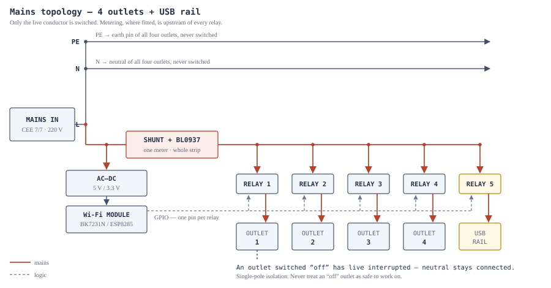

# 08 — Teardown reference

What is actually inside strips of this class, drawn from published teardowns of
the same PCB families. Every specific pin number here belongs to a *named*
device — none of it is a generic truth, and none of it is a substitute for
opening your own unit and following
[`01-device-identification.md`](01-device-identification.md).

## Schematics

Original drawings, in [`../hardware/schematics/`](../hardware/schematics/):

| Drawing | What it shows |
| --- | --- |
| [`01-mains-topology.svg`](../hardware/schematics/01-mains-topology.svg) | The power path: PE and N unswitched to every outlet, L through one shunt then five relays |
| [`02-relay-driver.svg`](../hardware/schematics/02-relay-driver.svg) | One relay channel: GPIO → base resistor → transistor → coil, flyback diode, contact rating, isolation barrier |
| [`03-metering-front-end.svg`](../hardware/schematics/03-metering-front-end.svg) | BL0937 shunt and divider, the multiplexed CF1 output, why calibration and not frequency is what matters |
| [`04-system-architecture.svg`](../hardware/schematics/04-system-architecture.svg) | Software: strips → broker → server → phone, and where remote access comes from |

---

## Published teardowns of the same PCB families

These are the reference points for the pin maps below. They are *similar*
hardware, not your hardware.

| Device | Module / chip | Metering | Notes |
| --- | --- | --- | --- |
| Tuya XS-A26 power strip, 4 AC + 4 USB | CB3S / **BK7231N** | none | The closest published match to a 4-outlet + USB strip. PCB marked `YX-B3S1-VER00`. |
| Generic Wi-Fi smart power strip, model **SM-SO301K** (4 outlets + 5 V USB) | CB3S / **BK7231N** | none | Flashed over UART: temporary wires to 3V3, GND, TXD, RXD, CEN shorted to GND during the handshake. |
| Action LSC SmartPlug 3202087 | CB2S / **BK7231N** | **BL0937** | Single socket, but the most completely documented metering pin map in this family. |
| Elworks smart dual socket | CB2S / **BK7231N** | **BL0937** | Two-gang variant of the same design. |
| AOFO smart power strip C733 | CB2S / **BK7231N** | via MCU | **TuyaMCU** — a second MCU owns the relays. This is the expensive branch of the decision tree. |
| Generic 20 A EU smart plug | **BK7231N** | BL0937 | Chip mounted directly on the main PCB, no separate module. Worth knowing this variant exists. |

Sources for all of these are listed in [`sources.md`](sources.md), with a note
on which ones this research could reach directly and which came through search
summaries only.

---

## Pin maps from named devices

### Tuya XS-A26 — 4 relays + USB rail, no metering

The map that most closely matches the hardware this project targets. In
OpenBeken role terms:

| Pin | Role | Function |
| --- | --- | --- |
| `P7` | `Rel` ch 1 | Outlet 1 |
| `P8` | `Rel` ch 2 | Outlet 2 |
| `P14` | `Rel` ch 3 | Outlet 3 |
| `P9` | `Rel` ch 4 | Outlet 4 |
| `P24` | `Rel` ch 5 | USB rail |
| `P26` | `Btn_Tgl_All` | Master button, toggles everything |
| `P23` | `WifiLED_n` | Status LED, **active low** |

### Action LSC 3202087 — single socket with BL0937

| Pin | Role |
| --- | --- |
| `P8` | Relay |
| `P7` | Button |
| `P6` | LED |
| `P10` | Wi-Fi LED |
| `P11` | BL0937 `SEL` |
| `P24` | BL0937 `CF1` |
| `P26` | BL0937 `CF` |

### Read these two tables together

`P7`, `P8`, `P24` and `P26` appear in both, meaning completely different things.
That is the single most important fact on this page: **a metering strip and a
non-metering strip from the same factory do not share a pin map.** Copying a map
from a teardown that looks like your unit is how people end up driving a
metering input as a relay output.

The verification procedure is in
[`02-hardware-reference.md`](02-hardware-reference.md) and drawn in
[`02-relay-driver.svg`](../hardware/schematics/02-relay-driver.svg): unplug the
strip from mains, feed 3.3 V to the module alone, drive each candidate pin, and
listen for the click. Nothing is at mains potential and it takes ten minutes.

---

## Getting a correct config without guessing

Two tools remove the guesswork entirely, and both are better than any table:

**[UPK2ESPHome](https://upk.libretiny.eu/)** reads the *stock firmware's own*
Tuya configuration blob — the factory's pin map — and emits a matching ESPHome
YAML with relays, buttons, LEDs and the metering chip already wired up. If you
can dump the storage partition from one unit, this is the fastest route to a
correct config for a variant nobody has documented.

**OpenBeken's `tuya-cloudcutter` profile database** carries per-device pin
profiles for hundreds of units. If your unit matches a profile, the flashing
tool applies the right map for you.

For a **TuyaMCU** unit there is no pin map to find. Put OpenBeken into TuyaMCU
debug mode, press each physical button, and read the datapoint IDs out of the
log; then bind them with `linkTuyaMCUOutputToChannel [dpId] [varType]
[channelID]`. You are mapping datapoints to channels, not pins.

---

## OpenBeken commands worth knowing during bring-up

| Command | Use |
| --- | --- |
| `SetPinRole [pin] [role]` | Assign a role — usually easier in the web UI |
| `SetPinChannel [pin] [channel]` | Bind a pin to a channel |
| `SetChannel [ch] [0\|1]` | Drive a channel directly — this is how you hunt for relays |
| `POWER1 ON` / `POWERALL OFF` | Tasmota-style relay control |
| `linkTuyaMCUOutputToChannel [dpId] [type] [ch]` | Bind a TuyaMCU datapoint to a channel |
| `PowerSet [watts]` / `CurrentSet [amps]` | Calibrate metering against a reference meter; persists to flash |

`PowerSet` and `CurrentSet` are the whole calibration story: put a known
resistive load on the strip, measure it with a clamp meter, and tell the
firmware what the true value is. Do this before anyone sees a kWh figure.

---

## Photographs

There are **no third-party teardown photographs in this repository, on purpose.**
Photographs in forum teardowns belong to the people who took them; copying them
into a repository that may be redistributed is a copyright problem, not a
technical one, and the schematics above carry more information per pixel anyway.

What belongs here is photographs of **your** units. The capture protocol, the
naming convention and the manifest are in
[`../hardware/photos/README.md`](../hardware/photos/README.md). Photograph the
first unit you open before you change anything — it is the only record of how it
left the factory, and you will want it when unit 40 does not match unit 1.
