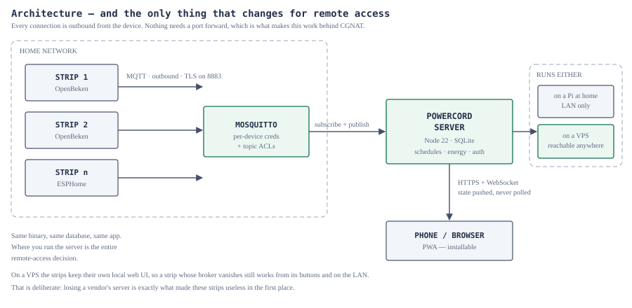

# 11 — Do you need a server to use the strips away from home?

**Short answer: yes, something has to be running somewhere — but it is one small
server you own, not a vendor cloud, and the same server you already run at home.
Where you run it is the entire decision.**

---

## Why you cannot just connect to the strip directly

Three things stand in the way, and none of them can be argued with:

1. **The strip is on a private address.** `192.168.1.42` means nothing outside
   the house.
2. **Egyptian residential internet is largely CGNAT.** Your router does not have
   a public IP of its own — it shares one with hundreds of other subscribers.
   Port forwarding cannot help, because there is no port on the public side that
   belongs to you. Dynamic DNS does not help either; it resolves a name to an
   address you do not control.
3. **You should not want to.** Exposing a device that switches mains relays
   directly to the internet is a genuinely bad idea, CGNAT or not.

So both sides — the strip and your phone — must make **outbound** connections to
a common point. That common point is the server. This is exactly the shape the
original Korean product used; the difference is that you own this one, and it
cannot be switched off from Seoul.

---

## The four options

| | Where it runs | Cost | Works behind CGNAT | Effort | Good for |
| --- | --- | --- | --- | --- | --- |
| **A. LAN only** | Pi or old laptop at home | ~0 | n/a — home only | Lowest | You only ever control the strips while at home |
| **B. VPN mesh** (Tailscale, WireGuard) | Pi at home + app on phone | Free tier | Yes, via relays | Low | One household, technical owner |
| **C. Your own VPS** | A small cloud server | ~$4–6/month | Yes | Medium | **A product with customers — recommended** |
| **D. Cloudflare Tunnel** | Pi at home + Cloudflare | Free | Yes | Low–medium | One household, no VPS wanted |

### A — LAN only

Run the server on a Raspberry Pi at home. Everything in this repository works.
When you leave the house, the app stops reaching it — that is the whole
limitation. Nothing is exposed to the internet, which is also the whole benefit.

Start here. It is the honest first release, and B, C and D are all "the same
thing, reachable from further away".

### B — VPN mesh

Install Tailscale on the Pi and on the phone. Both join a private network, and
the phone reaches the Pi at a stable address from anywhere. Tailscale's relays
punch through CGNAT for you, so there is nothing to configure on the router.

Excellent for your own household. It does not scale to customers: every user
would need to be on your tailnet, which is not a product.

### C — Your own VPS  ← recommended for deployment

One small cloud server runs Mosquitto and the Power Cord server. The strips
connect **outbound** to the broker over TLS; the phone connects **outbound** to
the server over HTTPS. Neither side needs an inbound port, so CGNAT is
irrelevant.

This is the option the repository is built and documented for. A $4/month box
handles hundreds of strips — the traffic is a few hundred bytes per strip per
ten seconds. Full build instructions in
[`09-backend-manual.md`](09-backend-manual.md).

**The failure mode to design against.** You are now the vendor whose server
these devices depend on. If your VPS dies, do the strips become bricks again?
No — and making sure of that is a deliberate design decision, not luck:

- Leave the strips' **local** web UI and HTTP interface enabled. A strip whose
  broker is unreachable still works from its buttons and from any browser on
  the LAN.
- The strip's own countdown timers and relay power-on behaviour live in
  firmware, so they keep working with no server at all.
- Anyone can run their own copy of this server. The whole thing is a few
  hundred kilobytes and one SQLite file.

That is the difference between what you are building and what you were handed.

### D — Cloudflare Tunnel

`cloudflared` on the Pi makes an outbound connection to Cloudflare, which
publishes `https://yourname.example.com` and routes it back down the tunnel. No
VPS, no port forwarding, free tier, and TLS handled for you.

The catch is that Cloudflare terminates TLS and can see the traffic, and you
depend on their service — a smaller version of the dependency you are escaping.
Fine for one household; think harder before shipping it to customers.

---

## What to actually do

1. **Now:** run option A. `npm run demo` already gives you the whole stack on
   one machine. Get the strips working at home first.
2. **When you want remote access for yourself:** add option B. An afternoon.
3. **When you have customers:** move to option C, following
   [`09-backend-manual.md`](09-backend-manual.md), with TLS, per-device broker
   credentials and topic ACLs from the start.

There is no step where you need a Korean account, a vendor cloud, or a
subscription.

---

## Security, if you go past option A

The moment the server is reachable from the internet, these stop being good
practice and start being requirements. Someone who can switch your relays can
start a fire with a space heater.

- **TLS everywhere.** HTTPS for the app (a reverse proxy with Let's Encrypt),
  MQTTS on 8883 for the strips. Never plaintext MQTT across the internet.
- **Per-device broker credentials and topic ACLs.** One username per strip,
  confined to its own topic prefix — the template is in
  [`../deploy/mosquitto/acl`](../deploy/mosquitto/acl). One compromised strip
  must not reach another.
- **Turn off `PC_AUTO_DISCOVER`** on a shared broker, so a stranger's device
  cannot register itself into your account.
- **Password-protect each strip's own web UI and OTA endpoint.** Freshly
  flashed OpenBeken and ESPHome ship open. The OTA endpoint accepts arbitrary
  firmware — it is the highest-value target in the system.
- **Change the seeded admin password**, and do not reuse it anywhere.
- **Back up `data/powercord.db`.** It holds your users, strips and history.

Nothing here is exotic. It is the minimum for a box that controls mains
electricity in other people's homes.
